# Architecture Diagrams - Bookstore Microservices

## 1) Overall System Architecture

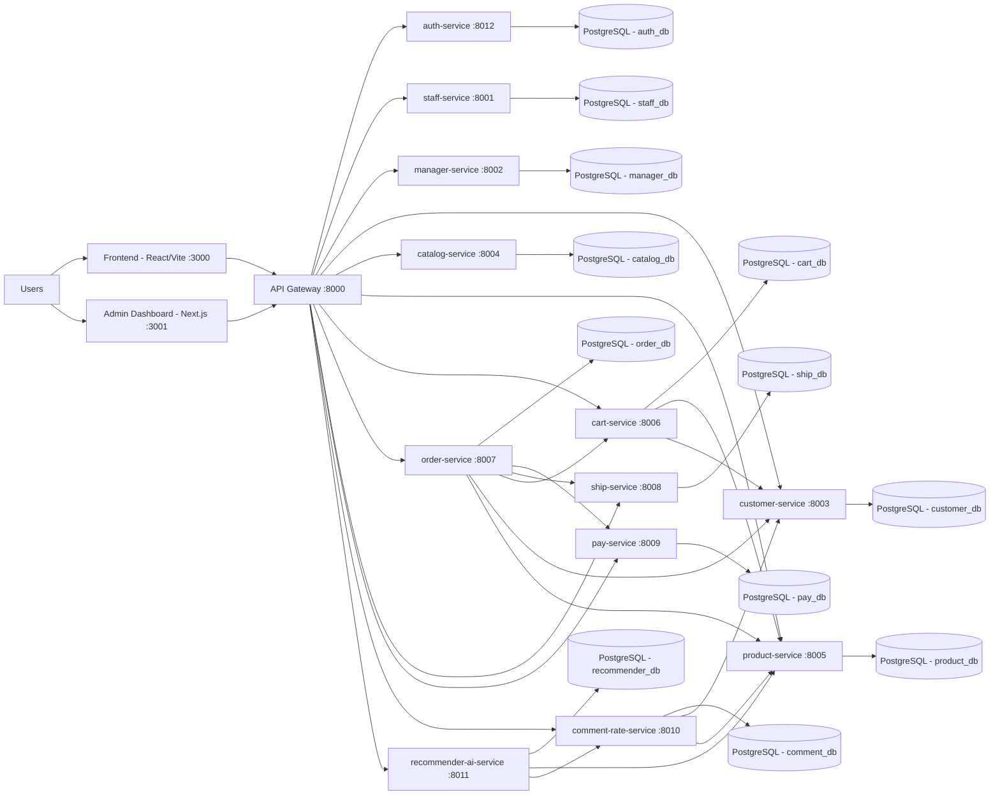

## 2) API Gateway Service

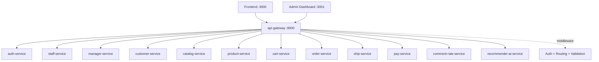

## 3) auth-service

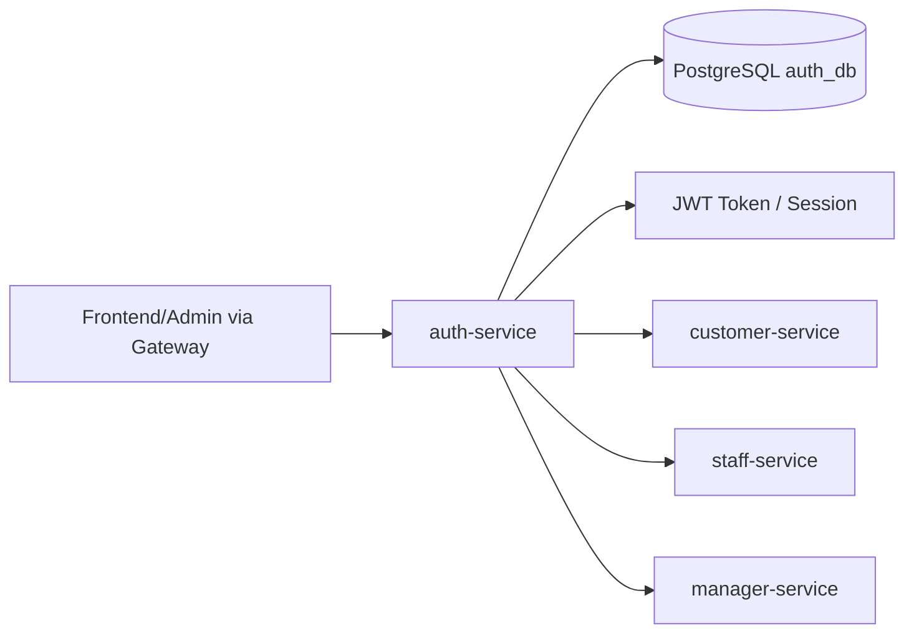

## 4) staff-service

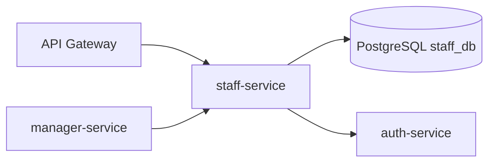

## 5) manager-service

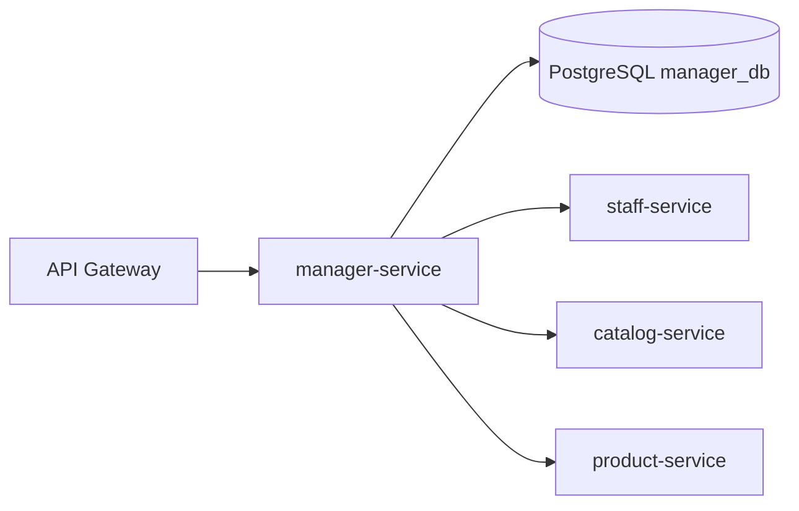

## 6) customer-service

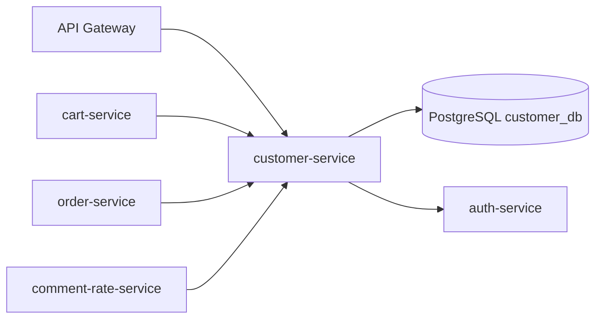

## 7) catalog-service

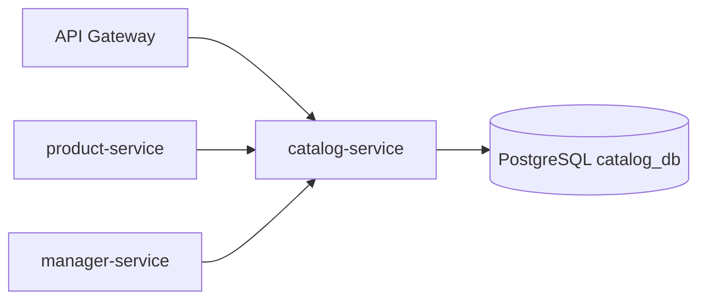

## 8) product-service

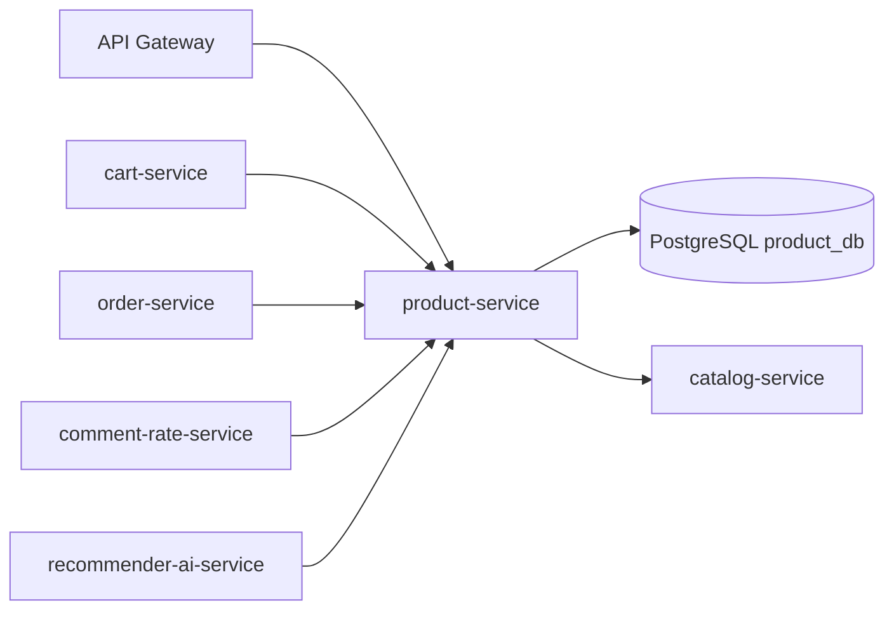

## 9) cart-service

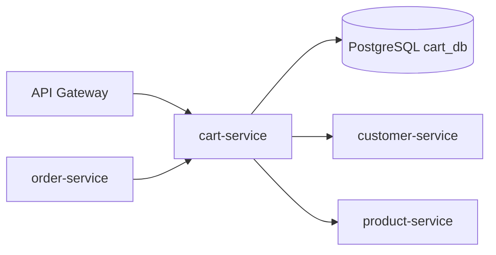

## 10) order-service

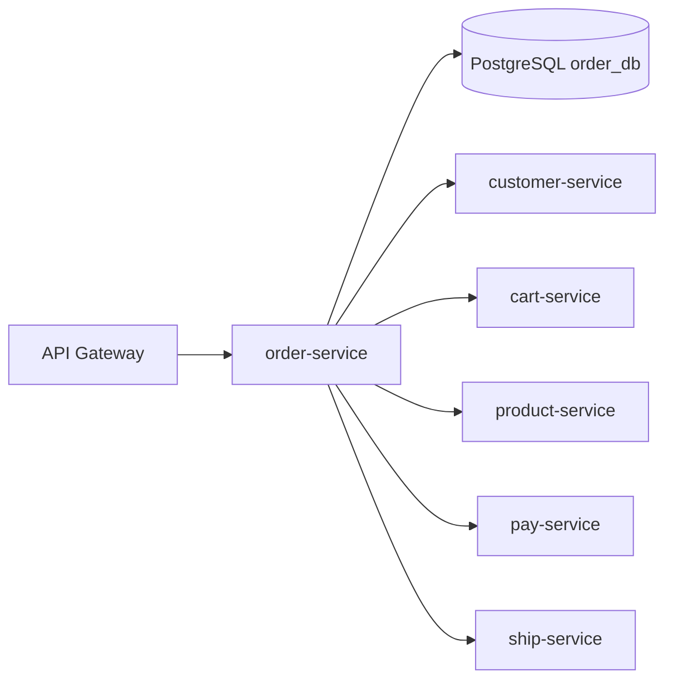

## 11) ship-service

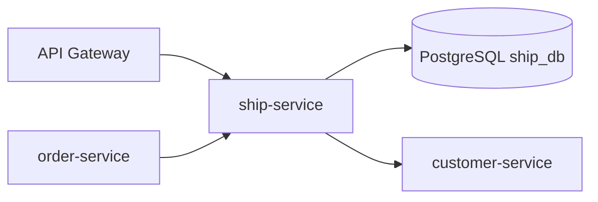

## 12) pay-service

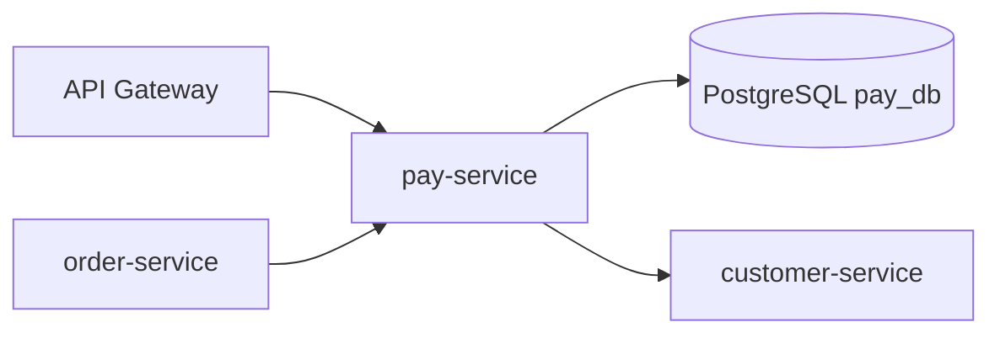

## 13) comment-rate-service

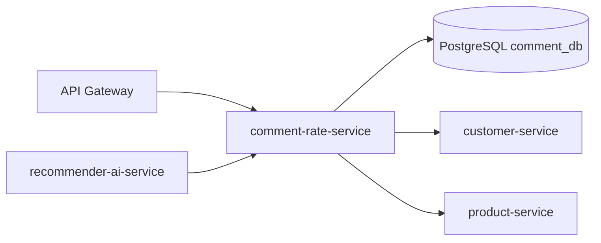

## 14) recommender-ai-service

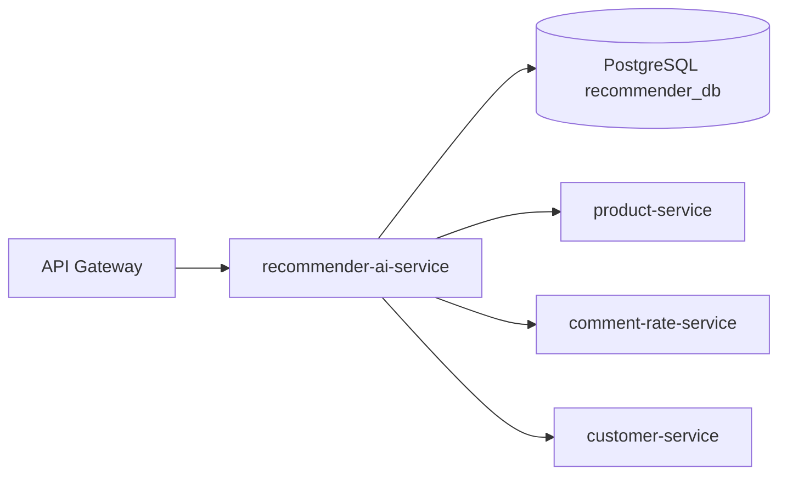

---

## Notes

- Port for auth-service is set to 8012 as a suggested value because current range 8000-8011 is already occupied.
- If actual runtime dependencies differ from this model, update service-to-service edges accordingly.
- These diagrams focus on logical architecture (request flow + service boundaries + per-service database).
