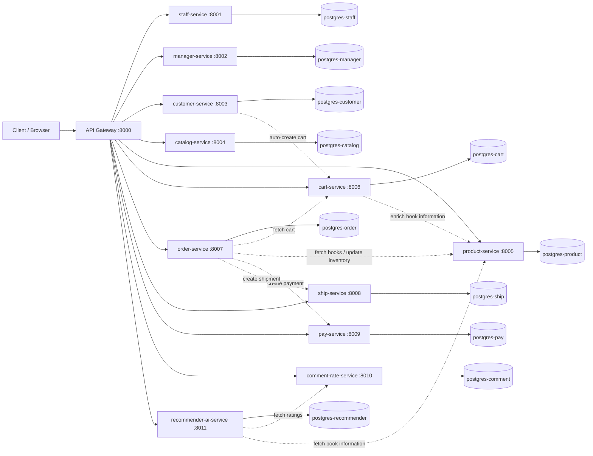

## Microservices Architecture Diagram



## API Documentation

This document describes the APIs currently exposed according to the current source code in the project. All client requests pass through the API Gateway.

## Base URL

- Gateway: `http://localhost:8000`
- Gateway route pattern: `http://localhost:8000/api/{service_name}/{resource_path}`

Examples:

- `http://localhost:8000/api/books/books/`
- `http://localhost:8000/api/orders/orders/create_from_cart/`

## Gateway Routes (api-gateway)

| Method | Endpoint                        | Description                                     |
| ------ | ------------------------------- | ----------------------------------------------- |
| GET    | `/api/health/`                  | Gateway health check                            |
| GET    | `/api/services/`                | List registered services                        |
| ALL    | `/api/{service_name}/{path...}` | Proxy request to the corresponding microservice |

## Service Registry at Gateway

| service_name      | Internal URL (Docker network)        |
| ----------------- | ------------------------------------ |
| `staff`           | `http://staff-service:8000`          |
| `managers`        | `http://manager-service:8000`        |
| `customers`       | `http://customer-service:8000`       |
| `catalogs`        | `http://catalog-service:8000`        |
| `books`           | `http://product-service:8000`           |
| `carts`           | `http://cart-service:8000`           |
| `orders`          | `http://order-service:8000`          |
| `shipments`       | `http://ship-service:8000`           |
| `payments`        | `http://pay-service:8000`            |
| `comments`        | `http://comment-rate-service:8000`   |
| `recommendations` | `http://recommender-ai-service:8000` |

---

## Book Service (`books`)

Gateway base: `/api/books/`

### Default CRUD (DRF ModelViewSet)

| Method | Endpoint                 |
| ------ | ------------------------ |
| GET    | `/api/books/books/`      |
| POST   | `/api/books/books/`      |
| GET    | `/api/books/books/{id}/` |
| PUT    | `/api/books/books/{id}/` |
| PATCH  | `/api/books/books/{id}/` |
| DELETE | `/api/books/books/{id}/` |

### Custom actions

| Method | Endpoint                                       | Description                 |
| ------ | ---------------------------------------------- | --------------------------- |
| GET    | `/api/books/books/by_catalog/?catalog_id={id}` | Filter books by catalog     |
| GET    | `/api/books/books/search/?q={keyword}`         | Search by title             |
| POST   | `/api/books/books/{id}/update_stock/`          | Update stock (+/- quantity) |

## Catalog Service (`catalogs`)

Gateway base: `/api/catalogs/`

| Method | Endpoint                       |
| ------ | ------------------------------ |
| GET    | `/api/catalogs/catalogs/`      |
| POST   | `/api/catalogs/catalogs/`      |
| GET    | `/api/catalogs/catalogs/{id}/` |
| PUT    | `/api/catalogs/catalogs/{id}/` |
| PATCH  | `/api/catalogs/catalogs/{id}/` |
| DELETE | `/api/catalogs/catalogs/{id}/` |

## Customer Service (`customers`)

Gateway base: `/api/customers/`

### Default CRUD

| Method | Endpoint                         |
| ------ | -------------------------------- |
| GET    | `/api/customers/customers/`      |
| POST   | `/api/customers/customers/`      |
| GET    | `/api/customers/customers/{id}/` |
| PUT    | `/api/customers/customers/{id}/` |
| PATCH  | `/api/customers/customers/{id}/` |
| DELETE | `/api/customers/customers/{id}/` |

### Custom actions

| Method | Endpoint                             | Description                            |
| ------ | ------------------------------------ | -------------------------------------- |
| POST   | `/api/customers/customers/register/` | Register customer and auto-create cart |
| POST   | `/api/customers/customers/login/`    | Customer login                         |

## Staff Service (`staff`)

Gateway base: `/api/staff/`

| Method    | Endpoint                  | Description   |
| --------- | ------------------------- | ------------- |
| GET       | `/api/staff/staff/`       | List staff    |
| POST      | `/api/staff/staff/`       | Create staff  |
| GET       | `/api/staff/staff/{id}/`  | Staff details |
| PUT/PATCH | `/api/staff/staff/{id}/`  | Update staff  |
| DELETE    | `/api/staff/staff/{id}/`  | Delete staff  |
| POST      | `/api/staff/staff/login/` | Staff login   |

## Manager Service (`managers`)

Gateway base: `/api/managers/`

| Method    | Endpoint                        | Description     |
| --------- | ------------------------------- | --------------- |
| GET       | `/api/managers/managers/`       | List managers   |
| POST      | `/api/managers/managers/`       | Create manager  |
| GET       | `/api/managers/managers/{id}/`  | Manager details |
| PUT/PATCH | `/api/managers/managers/{id}/`  | Update manager  |
| DELETE    | `/api/managers/managers/{id}/`  | Delete manager  |
| POST      | `/api/managers/managers/login/` | Manager login   |

## Cart Service (`carts`)

Gateway base: `/api/carts/`

### Default CRUD

| Method | Endpoint                 |
| ------ | ------------------------ |
| GET    | `/api/carts/carts/`      |
| POST   | `/api/carts/carts/`      |
| GET    | `/api/carts/carts/{id}/` |
| PUT    | `/api/carts/carts/{id}/` |
| PATCH  | `/api/carts/carts/{id}/` |
| DELETE | `/api/carts/carts/{id}/` |

### Custom actions

| Method | Endpoint                                                      | Description                  |
| ------ | ------------------------------------------------------------- | ---------------------------- |
| GET    | `/api/carts/carts/by_customer/?customer_id={id}`              | Get cart by customer         |
| POST   | `/api/carts/carts/add_item/`                                  | Add item to cart             |
| PUT    | `/api/carts/carts/update_item/`                               | Update item quantity in cart |
| DELETE | `/api/carts/carts/remove_item/?customer_id={id}&book_id={id}` | Remove one item from cart    |
| DELETE | `/api/carts/carts/clear/?customer_id={id}`                    | Clear the entire cart        |

## Order Service (`orders`)

Gateway base: `/api/orders/`

### Default CRUD

| Method | Endpoint                   |
| ------ | -------------------------- |
| GET    | `/api/orders/orders/`      |
| POST   | `/api/orders/orders/`      |
| GET    | `/api/orders/orders/{id}/` |
| PUT    | `/api/orders/orders/{id}/` |
| PATCH  | `/api/orders/orders/{id}/` |
| DELETE | `/api/orders/orders/{id}/` |

### Custom actions

| Method | Endpoint                                           | Description                                           |
| ------ | -------------------------------------------------- | ----------------------------------------------------- |
| POST   | `/api/orders/orders/create_from_cart/`             | Create order from cart and trigger payment & shipment |
| GET    | `/api/orders/orders/by_customer/?customer_id={id}` | Get orders by customer                                |
| POST   | `/api/orders/orders/{id}/cancel/`                  | Cancel order (when not shipped/delivered)             |

## Payment Service (`payments`)

Gateway base: `/api/payments/`

### Default CRUD

| Method | Endpoint                       |
| ------ | ------------------------------ |
| GET    | `/api/payments/payments/`      |
| POST   | `/api/payments/payments/`      |
| GET    | `/api/payments/payments/{id}/` |
| PUT    | `/api/payments/payments/{id}/` |
| PATCH  | `/api/payments/payments/{id}/` |
| DELETE | `/api/payments/payments/{id}/` |

### Custom actions

| Method | Endpoint                                         | Description                 |
| ------ | ------------------------------------------------ | --------------------------- |
| POST   | `/api/payments/payments/{id}/process/`           | Process payment (completed) |
| POST   | `/api/payments/payments/{id}/refund/`            | Refund payment              |
| GET    | `/api/payments/payments/by_order/?order_id={id}` | List payments by order      |

## Shipping Service (`shipments`)

Gateway base: `/api/shipments/`

### Default CRUD

| Method | Endpoint                         |
| ------ | -------------------------------- |
| GET    | `/api/shipments/shipments/`      |
| POST   | `/api/shipments/shipments/`      |
| GET    | `/api/shipments/shipments/{id}/` |
| PUT    | `/api/shipments/shipments/{id}/` |
| PATCH  | `/api/shipments/shipments/{id}/` |
| DELETE | `/api/shipments/shipments/{id}/` |

### Custom actions

| Method | Endpoint                                                 | Description              |
| ------ | -------------------------------------------------------- | ------------------------ |
| POST   | `/api/shipments/shipments/{id}/update_status/`           | Update shipping status   |
| GET    | `/api/shipments/shipments/by_order/?order_id={id}`       | Get shipment by order    |
| GET    | `/api/shipments/shipments/track/?tracking_number={code}` | Track by tracking number |

## Comment & Rate Service (`comments`)

Gateway base: `/api/comments/`

### Default CRUD

| Method | Endpoint                       |
| ------ | ------------------------------ |
| GET    | `/api/comments/comments/`      |
| POST   | `/api/comments/comments/`      |
| GET    | `/api/comments/comments/{id}/` |
| PUT    | `/api/comments/comments/{id}/` |
| PATCH  | `/api/comments/comments/{id}/` |
| DELETE | `/api/comments/comments/{id}/` |

### Custom actions

| Method | Endpoint                                               | Description                          |
| ------ | ------------------------------------------------------ | ------------------------------------ |
| GET    | `/api/comments/comments/by_book/?book_id={id}`         | Get reviews by book + average rating |
| GET    | `/api/comments/comments/by_customer/?customer_id={id}` | Get reviews by customer              |
| GET    | `/api/comments/comments/all_ratings/`                  | Return all ratings (for recommender) |

## Recommender AI Service (`recommendations`)

Gateway base: `/api/recommendations/`

| Method | Endpoint                                                           | Description                                      |
| ------ | ------------------------------------------------------------------ | ------------------------------------------------ |
| GET    | `/api/recommendations/recommendations/?customer_id={id}&top_n={n}` | Recommend books based on collaborative filtering |

---

## System Technical Report

## 1) Executive Summary

Bookstore Microservices is an e-commerce system split into multiple independent domain-based services. This architecture makes the system easier to scale, easier to maintain, and reduces cascade impact when one service encounters issues.

The system currently uses Django REST Framework for backend services, PostgreSQL per service, Docker Compose for orchestration, and an API Gateway as the single entry point for clients.

## 2) Design Goals

- **Scalability**: scale by domain (order, book, recommendation...) instead of scaling the entire system.
- **Isolation**: each service has its own database, reducing data coupling.
- **Maintainability**: code is organized by bounded context, making team ownership easier.
- **Deployability**: each service can be built/deployed independently.

## 3) Overall Architecture

### 3.1 Monorepo

All services are placed in one repository to keep versions, Docker Compose infrastructure, and seed/test scripts synchronized.

### 3.2 API Gateway Pattern

The gateway receives all requests via `/api/{service_name}/{path}` and forwards them to the corresponding service based on the `SERVICES` map. This allows frontend apps to use a single base URL (`http://localhost:8000`).

### 3.3 Internal Communication

Services communicate synchronously over HTTP (using the `requests` library).

Important flows:

- customer-service registers a user -> calls cart-service to create a default cart.
- order-service creates an order from cart -> calls product-service (price/stock), pay-service (payment), ship-service (shipment), cart-service (clear cart).
- recommender-ai-service -> fetches ratings from comment-rate-service and book data from product-service.

## 4) Data and Persistence

The project currently uses **database-per-service** on the same Docker Compose cluster:

- `postgres-staff`, `postgres-manager`, `postgres-customer`, `postgres-catalog`, `postgres-product`, `postgres-cart`, `postgres-order`, `postgres-ship`, `postgres-pay`, `postgres-comment`, `postgres-recommender`.

Benefits:

- Separates data lifecycle by domain.
- Avoids direct cross-service joins.
- Supports per-database scaling based on real demand.

## 5) Container Infrastructure & Service Ports

| Component              | Host Port | Container Port |
| ---------------------- | --------: | -------------: |
| frontend               |      3000 |             80 |
| admin-dashboard        |      3001 |           3000 |
| api-gateway            |      8000 |           8000 |
| staff-service          |      8001 |           8000 |
| manager-service        |      8002 |           8000 |
| customer-service       |      8003 |           8000 |
| catalog-service        |      8004 |           8000 |
| product-service           |      8005 |           8000 |
| cart-service           |      8006 |           8000 |
| order-service          |      8007 |           8000 |
| ship-service           |      8008 |           8000 |
| pay-service            |      8009 |           8000 |
| comment-rate-service   |      8010 |           8000 |
| recommender-ai-service |      8011 |           8000 |

## 6) Frontend / Web UI

- **Frontend (React + Vite, port 3000):** end-user interface.
- **Admin Dashboard (Next.js 14 + Shadcn, port 3001):** service data administration.

The admin dashboard reads data through the gateway via environment variables:

- `NEXT_PUBLIC_API_URL=http://localhost:8000` (local)
- `NEXT_PUBLIC_API_URL=http://api-gateway:8000` (docker network)

## 7) Operations and Quick Testing

### Start the system

```bash
docker-compose up --build -d
```

### Seed data

```powershell
.\seed_data.ps1
```

### Test APIs

```powershell
.\test_api_endpoints.ps1
```

## 8) Extension Proposals

- Add centralized auth (JWT/OAuth2) at the gateway or a dedicated identity service.
- Add a message broker (RabbitMQ/Kafka) for asynchronous flows (order -> payment/shipping events).
- Add Redis cache for high-read paths (books, catalogs, recommendations).
- Standardize observability (centralized logging, tracing, metrics).

## 9) Conclusion

The Bookstore Microservices system already has a strong foundation for learning and practical extension: clearly separated domains, consistent API routing through the gateway, and fully connected core business flows (customer/cart/order/payment/shipping/recommendation). With added security and event-driven communication in the future, the architecture can move closer to production-grade standards at larger scale.
